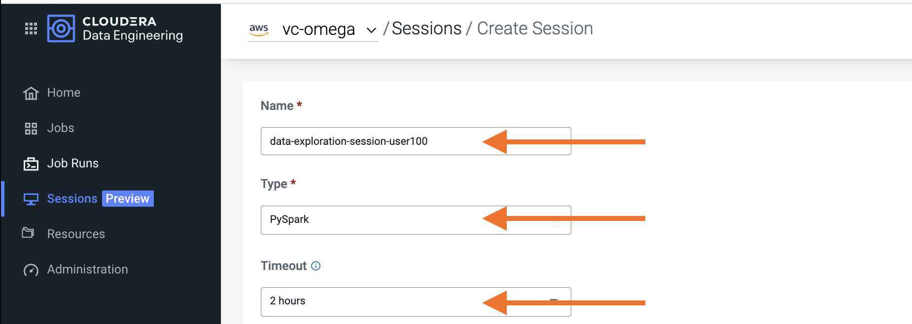
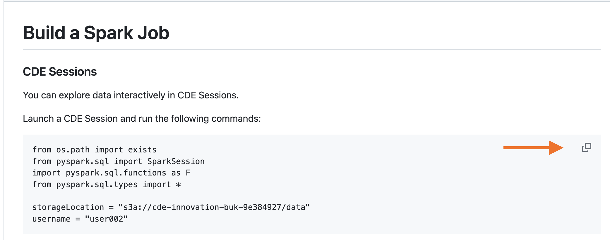
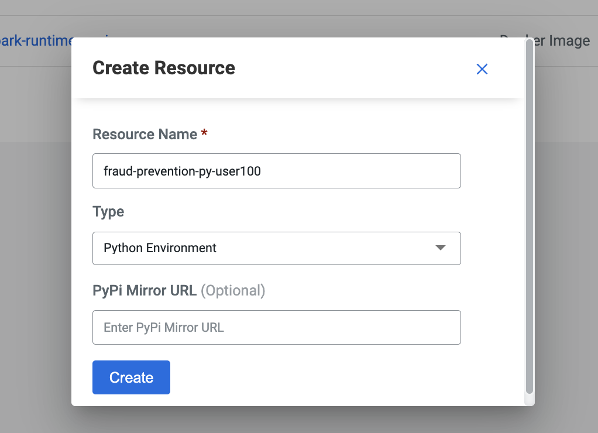
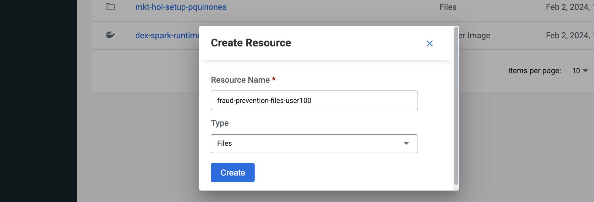
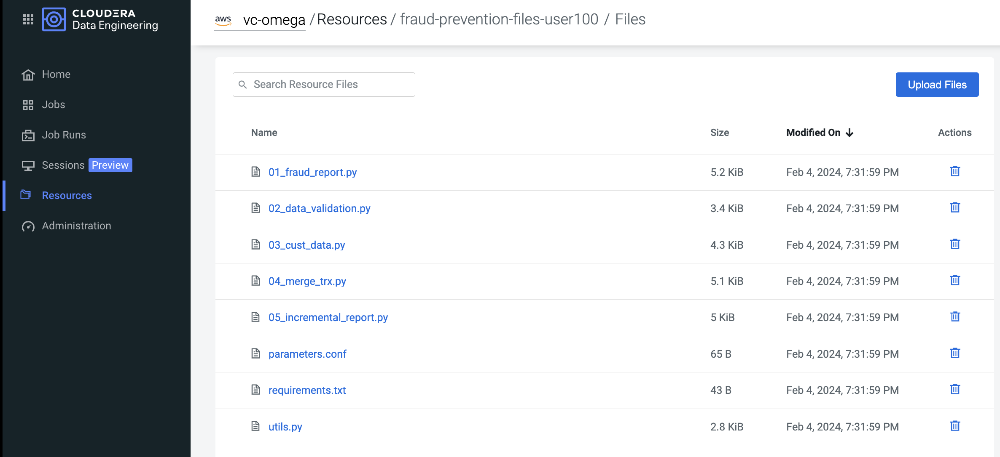
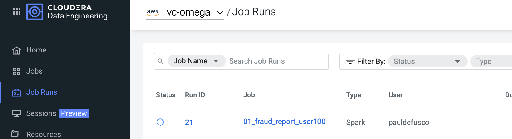
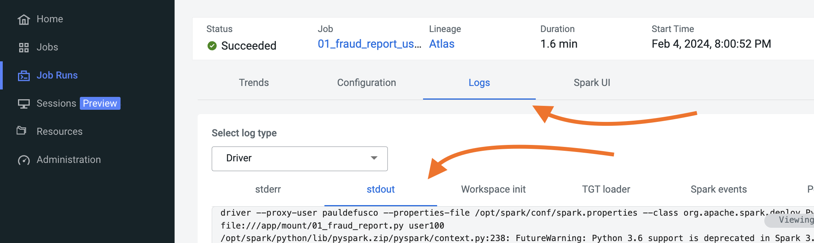

# Part 1: Apache Spark in CDE

* [A Brief Introduction to Spark](https://github.com/pdefusco/CDE_Banking_HOL_MKT/blob/main/step_by_step_guides/english/part_01_spark.md#a-brief-introduction-to-spark)
* [Lab 1: Run PySpark Interactive Session](https://github.com/pdefusco/CDE_Banking_HOL_MKT/blob/main/step_by_step_guides/english/part_01_spark.md#lab-1-run-pyspark-interactive-session)
* [Lab 2: Create CDE Resources and Run CDE Spark Job](https://github.com/pdefusco/CDE_Banking_HOL_MKT/blob/main/step_by_step_guides/english/part_01_spark.md#lab-2-create-cde-resources-and-run-cde-spark-job)
* [Summary](https://github.com/pdefusco/CDE_Banking_HOL_MKT/blob/main/step_by_step_guides/english/part_01_spark.md#summary)
* [Useful Links and Resources](https://github.com/pdefusco/CDE_Banking_HOL_MKT/blob/main/step_by_step_guides/english/part_01_spark.md#useful-links-and-resources)

### A Brief Introduction to Spark

Apache Spark is an open-source, distributed processing system used for big data workloads. It has gained extreme popularity as the go-to engine for interactive Data Analysis and the deployment of Production Data Engineering and Machine Learning pipelines at scale.

In CDE you can use Spark to explore data interactively via CDE Sessions or deploy batch data engineering pipelines via CDE Jobs.

### Lab 1: Run PySpark Interactive Session

Navigate to the CDE Home Page and launch a PySpark Session. Leave default settings intact.



Once the Session is ready, open the "Interact" tab in order to enter your code.


You can copy and paste code from the instructions into the notebook by clicking on the icon at the top right of the code cell.



Copy the following cell into the notebook. Before running it, ensure that you have edited the "username" variable with your assigned user.

```
from os.path import exists
from pyspark.sql import SparkSession
import pyspark.sql.functions as F
from pyspark.sql.types import *

storageLocation = "s3a://go01-demo/data"
username = "user002"
```


No more code edits are required. Continue running each code snippet below in separate cells in the notebook.

```
### LOAD HISTORICAL TRANSACTIONS FILE FROM CLOUD STORAGE
firstBatchDf = spark.read.json("{0}/logistics/firstbatch/{1}/iotfleet".format(storageLocation, username))
firstBatchDf.printSchema()
```

```
### CREATE PYTHON FUNCTION TO FLATTEN PYSPARK DATAFRAME NESTED STRUCTS
def flatten_struct(schema, prefix=""):
    result = []
    for elem in schema:
        if isinstance(elem.dataType, StructType):
            result += flatten_struct(elem.dataType, prefix + elem.name + ".")
        else:
            result.append(F.col(prefix + elem.name).alias(prefix + elem.name))
    return result
```

```
### RUN PYTHON FUNCTION TO FLATTEN NESTED STRUCTS AND VALIDATE NEW SCHEMA
firstBatchDf = firstBatchDf.select(flatten_struct(firstBatchDf.schema))
firstBatchDf.printSchema()
```

```
### RENAME COLUMNS
firstBatchDf = firstBatchDf.withColumnRenamed("iot_geolocation.latitude", "latitude")
firstBatchDf = firstBatchDf.withColumnRenamed("iot_geolocation.longitude", "longitude")
```

```
### CAST COLUMN TYPES FROM STRING TO APPROPRIATE TYPE
firstBatchDf = firstBatchDf.withColumn("latitude",  firstBatchDf["latitude"].cast('float'))
firstBatchDf = firstBatchDf.withColumn("longitude",  firstBatchDf["longitude"].cast('float'))
firstBatchDf = firstBatchDf.withColumn("event_ts", firstBatchDf["event_ts"].cast("timestamp"))
```

```
### CALCULATE MEAN AND MEDIAN CREDIT CARD TRANSACTION AMOUNT
iotSignal4Mean = round(firstBatchDf.select(F.mean("iot_signal_4")).collect()[0][0],2)
iotSignal4Median = round(firstBatchDf.stat.approxQuantile("iot_signal_4", [0.5], 0.001)[0],2)

print("Transaction Amount Mean: ", iotSignal4Mean)
print("Transaction Amount Median: ", iotSignal4Median)
```

```
### CREATE SPARK TEMPORARY VIEW FROM DATAFRAME
firstBatchDf.createOrReplaceTempView("firstbatch")
spark.sql("SELECT * FROM firstbatch LIMIT 10").show()
```

```
### CALCULATE AVERAGE IOT SIGNAL 4 VALUE AMOUNT BY HOUR
spark.sql("SELECT hour(event_ts) AS hour, \
          avg(iot_signal_4) FROM firstbatch GROUP BY hour ORDER BY hour").show()
```

```
### CALCULATE COUNT OF DEVICE ID'S BY MANUFACTURER
spark.sql("SELECT manufacturer, COUNT(device_id) AS COUNT FROM firstbatch \
            GROUP BY manufacturer ORDER BY COUNT DESC LIMIT 10").show()
```

```
### CALCULATE AVERAGE IOT SIGNAL 4 BY MANUFACTURER
spark.sql("SELECT manufacturer, avg(iot_signal_4) AS AVG_SIG_4 FROM firstbatch \
            GROUP BY manufacturer ORDER BY AVG_SIG_4 DESC LIMIT 10").show()
```

```
### LOAD COMPANY DATA FROM CLOUD STORAGE
companyDf = spark.read.options(header='True', delimiter=',').csv("{0}/logistics/company/{1}/company_info".format(storageLocation, username))
companyDf.show()
companyDf.printSchema()
```

```
### CAST LAT LON TO FLOAT TYPE AND CREATE TEMPORARY VIEW
companyDf = companyDf.withColumn("facility_latitude",  companyDf["facility_latitude"].cast('float'))
companyDf = companyDf.withColumn("facility_longitude",  companyDf["facility_longitude"].cast('float'))
companyDf.createOrReplaceTempView("company_info")
```

```
### JOIN DATASETS AND COMPARE CREDIT CARD OWNER COORDINATES WITH TRANSACTION COORDINATES
joinDf = spark.sql("""SELECT iot.device_id, iot.event_type, iot.event_ts, iot.latitude, iot.longitude, iot.iot_signal_1,
          iot.iot_signal_2, iot.iot_signal_3, iot.iot_signal_4, i.company_name, i.company_email, i.facility_latitude, i.facility_longitude
          FROM company_info i INNER JOIN firstbatch iot
          ON i.manufacturer == iot.manufacturer;""")
joinDf.show()
```

```
### CREATE PYSPARK UDF TO CALCULATE DISTANCE BETWEEN FACILITY AND FLEET LOCATIONS
distanceFunc = F.udf(lambda arr: (((arr[2]-arr[0])**2)+((arr[3]-arr[1])**2)**(1/2)), FloatType())
distanceDf = joinDf.withColumn("device_dist_from_facility", distanceFunc(F.array("latitude", "longitude",
                                                                            "facility_latitude", "facility_longitude")))
```

```
### SELECT FLEET MALFUNCTIONS OCCURRING LESS THAN 200 MILES FROM FACILITY
distanceDf.filter((distanceDf.device_dist_from_facility < 200) & (distanceDf.event_type == "system malfunction")).show()
```


### Lab 2: Create CDE Resources and Run CDE Spark Job

Up until now you used Sessions to interactively explore data. CDE also allows you to run Spark Application code in batch with as a CDE Job. There are two types of CDE Jobs: Spark and Airflow. In this lab we will create a CDE Spark Job and revisit Airflow later in part 3.

The CDE Spark Job is an abstraction over the Spark Submit. With the CDE Spark Job you can create a reusable, modular Spark Submit definition that is saved in CDE and can be modified in the CDE UI (or via the CDE CLI and API) before every run according to your needs. CDE stores the job definition for each run in the Job Runs UI so you can go back and refer to it long after your job has completed.

Furthermore, CDE allows you to directly store artifacts such as Python files, Jars and other dependencies, or create Python environments and Docker containers in CDE as "CDE Resources". Once created in CDE, Resources are available to CDE Jobs as modular components of the CDE Job definition which can be swapped and referenced by a particular job run as needed.

These features dramatically reduce the amount of work and effort normally required to manage and monitor Spark Jobs in a Spark Cluster. By providing a unified view over all your runs along with the associated artifacts and dependencies, CDE streamlines CI/CD pipelines and removes the need for glue code in your Spark cluster.

In the next steps we will see these benefits in actions.

##### Create CDE Python Resource

Navigate to the Resources tab and create a Python Resource. Make sure to select the Virtual Cluster assigned to you if you are creating a Resource from the CDE Home Page, and to name the Python Resource after your username e.g. "iot-fleet-py-user100" if you are "user100".

Upload the "requirements.txt" file located in the "cde_spark_jobs" folder. This can take up to a few minutes.

Please familiarize yourself with the contents of the "requirements.txt" file and notice that it contains a few Python libraries such as Pandas and PyArrow.

Then, move on to the next section even while the environment build is still in progress.




##### Create CDE Files Resource

From the Resources page create a CDE Files Resource. Upload all files contained in the "cde_spark_jobs" folder. Again, ensure the Resource is named after your unique workshop username and it is created in the Virtual Cluster assigned to you.





Before moving on to the next step, please familiarize yourself with the code in the "01_fleet_report.py", "utils.py", and "parameters.conf" files.

Notice that "01_fleet_report.py" contains the same PySpark Application code you ran in the CDE Session, with the exception that the column casting and renaming steps have been refactored into Python functions in the "utils.py" script.

Finally, notice the contents of "parameters.conf". Storing variables in a file in a Files Resource is one method used by CDE Data Engineers to dynamically parameterize scripts with external values.

##### Create CDE Spark Job

Now that the CDE Resources have been created you are ready to create your first CDE Spark Job.

Navigate to the CDE Jobs tab and click on "Create Job". The long form loaded to the page allows you to build a Spark Submit as a CDE Spark Job, step by step.


Enter the following values without quotes into the corresponding fields. Make sure to update the username with your assigned user wherever needed:

* Job Type: Spark
* Name: 01_fleet_report_userxxx
* File: Select from Resource -> "01_fleet_report.py"
* Arguments: userxxx
* Configurations:
  - key: spark.sql.autoBroadcastJoinThreshold
  - value: 11M

The form should now look similar to this:


Finally, open the "Advanced Options" section.

Notice that your CDE Files Resource has already been mapped to the CDE Job for you.

Then, update the Compute Options by increasing "Executor Cores" and "Executor Memory" from 1 to 2.


Finally, run the CDE Job by clicking the "Create and Run" icon.

##### CDE Job Run Observability

Navigate to the Job Runs page in your Virtual Cluster and notice a new Job Run is being logged automatically for you.



Once the run completes, open the run details by clicking on the Run ID integer in the Job Runs page.


Open the logs tab and validate output from the Job Run in the Driver -> Stdout tab.



### Summary

In this section you first explored two datasets interactively with CDE Interactive sessions. This feature allowed you to run ad-hoc queries on large, structured and unstructured data, and prototype Spark Application code for batch execution.

Then, you created a batch Spark Job to turned your application prototype into scheduled execution.

In the process, you improved your code for reusability by modularizing your logic into functions, and stored those functions as a utils script in a CDE Files Resource. You also leveraged your Files Resource by storing dynamic variables in a parameters configurations file and applying a runtime variable via the Arguments field. In the context of more advanced Spark CI/CD pipelines both the parameters file and the Arguments field can be overwritten and overridden at runtime.

In order to improve performance you translated the PySpark UDF into a Pandas UDF. You created a CDE Python Resource and attached it to the CDE Job Definition in order to use Pandas and other Python libraries in your PySpark job.

Finally, you ran the job and observed outputs in the CDE Job Runs page. CDE stored Job Runs, logs, and associated CDE Resources for each run. This provided you real time job monitoring and troubleshooting capabilities, along with post-execution storage of logs, run dependencies, and cluster information.

### Useful Links and Resources

If you are curious to learn more about the above features in the context of more advanced use cases, please visit the following references:

* [Working with CDE Files Resources](https://community.cloudera.com/t5/Community-Articles/Working-with-CDE-Files-Resources/ta-p/379891)
* [Efficiently Monitoring Jobs, Runs, and Resources with the CDE CLI](https://community.cloudera.com/t5/Community-Articles/Efficiently-Monitoring-Jobs-Runs-and-Resources-with-the-CDE/ta-p/379893)
* [Working with CDE Spark Job Parameters in Cloudera Data Engineering](https://community.cloudera.com/t5/Community-Articles/Working-with-CDE-Spark-Job-Parameters-in-Cloudera-Data/ta-p/380792)
* [How to parse XMLs in CDE with the Spark XML Package](https://community.cloudera.com/t5/Community-Articles/How-to-parse-XMLs-in-Cloudera-Data-Engineering-with-the/ta-p/379451)
* [Spark Geospatial with Apache Sedona in CDE](https://community.cloudera.com/t5/Community-Articles/Spark-Geospatial-with-Apache-Sedona-in-Cloudera-Data/ta-p/378086)
