# Part 1: Apache Spark in CDE

* [Breve Introducción a Spark](https://github.com/pdefusco/cde_intro_hol_110424/blob/main/step_by_step_guides/espanol/part_01_spark.md#breve-introducci%C3%B3n-a-spark)
* [Lab 1: Ejecución de una Sesión Interactiva de PySpark](https://github.com/pdefusco/cde_intro_hol_110424/blob/main/step_by_step_guides/espanol/part_01_spark.md#lab-1-ejecuci%C3%B3n-de-una-sesi%C3%B3n-interactiva-de-pyspark)
* [Lab 2: Creación de CDE Resources y Ejecución de un Job CDE Spark](https://github.com/pdefusco/cde_intro_hol_110424/blob/main/step_by_step_guides/espanol/part_01_spark.md#lab-2-creaci%C3%B3n-de-cde-resources-y-ejecuci%C3%B3n-de-un-job-cde-spark)
* [Resumen](https://github.com/pdefusco/cde_intro_hol_110424/blob/main/step_by_step_guides/espanol/part_01_spark.md#resumen)
* [Enlaces y Recursos Útiles](https://github.com/pdefusco/cde_intro_hol_110424/blob/main/step_by_step_guides/espanol/part_01_spark.md#enlaces-y-recursos-%C3%BAtiles)

### Breve Introducción a Spark

Apache Spark es un sistema de procesamiento distribuido de código abierto utilizado para cargas de job de big data. Ha ganado una popularidad extrema como el motor preferido para análisis de datos interactivos y el despliegue de tuberías de producción de ingeniería de datos y aprendizaje automático a escala.

En CDE puedes utilizar Spark para explorar datos de forma interactiva a través de Sesiones CDE o desplegar tuberías de ingeniería de datos por lotes mediante Jobs de CDE.

### Lab 1: Ejecución de una Sesión Interactiva de PySpark

Dirígete a la página de inicio de CDE y lanza una sesión de PySpark. Deja intactos los ajustes predeterminados.


Una vez que la sesión esté lista, abre la pestaña "Interact" para ingresar tu código.

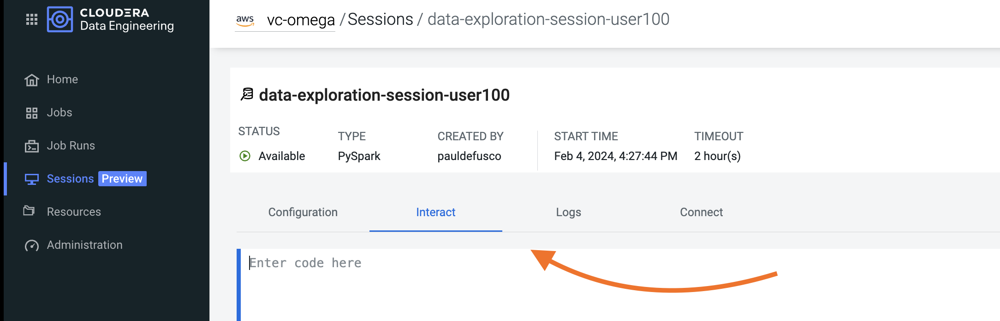

Puedes copiar y pegar el código de las instrucciones en el cuaderno haciendo clic en el ícono en la esquina superior derecha de la celda de código.


Copia la siguiente celda en el cuaderno. Antes de ejecutarla, asegúrate de haber editado la variable "username" con tu usuario asignado.

```
from os.path import exists
from pyspark.sql import SparkSession
import pyspark.sql.functions as F
from pyspark.sql.types import *

storageLocation = "s3a://bacpoccdp/data"
username = "user005"
```

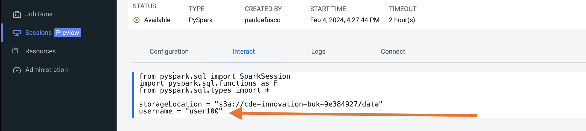

Ya no se requieren más ediciones en el código. Continúa ejecutando cada fragmento de código a continuación en celdas separadas dentro del Notebook.

```
### LOAD HISTORICAL TRANSACTIONS FILE FROM CLOUD STORAGE
firstBatchDf = spark.read.json("{0}/logistics/firstbatch/{1}/iotfleet".format(storageLocation, username))
firstBatchDf.printSchema()
```

```
### CREATE PYTHON FUNCTION TO FLATTEN PYSPARK DATAFRAME NESTED STRUCTS
def flatten_struct(schema, prefix=""):
    result = []
    for elem in schema:
        if isinstance(elem.dataType, StructType):
            result += flatten_struct(elem.dataType, prefix + elem.name + ".")
        else:
            result.append(F.col(prefix + elem.name).alias(prefix + elem.name))
    return result
```

```
### RUN PYTHON FUNCTION TO FLATTEN NESTED STRUCTS AND VALIDATE NEW SCHEMA
firstBatchDf = firstBatchDf.select(flatten_struct(firstBatchDf.schema))
firstBatchDf.printSchema()
```

```
### RENAME COLUMNS
firstBatchDf = firstBatchDf.withColumnRenamed("iot_geolocation.latitude", "latitude")
firstBatchDf = firstBatchDf.withColumnRenamed("iot_geolocation.longitude", "longitude")
```

```
### CAST COLUMN TYPES FROM STRING TO APPROPRIATE TYPE
firstBatchDf = firstBatchDf.withColumn("latitude",  firstBatchDf["latitude"].cast('float'))
firstBatchDf = firstBatchDf.withColumn("longitude",  firstBatchDf["longitude"].cast('float'))
firstBatchDf = firstBatchDf.withColumn("event_ts", firstBatchDf["event_ts"].cast("timestamp"))
```

```
### CALCULATE MEAN AND MEDIAN CREDIT CARD TRANSACTION AMOUNT
iotSignal4Mean = round(firstBatchDf.select(F.mean("iot_signal_4")).collect()[0][0],2)
iotSignal4Median = round(firstBatchDf.stat.approxQuantile("iot_signal_4", [0.5], 0.001)[0],2)

print("Transaction Amount Mean: ", iotSignal4Mean)
print("Transaction Amount Median: ", iotSignal4Median)
```

```
### CREATE SPARK TEMPORARY VIEW FROM DATAFRAME
firstBatchDf.createOrReplaceTempView("firstbatch")
spark.sql("SELECT * FROM firstbatch LIMIT 10").show()
```

```
### CALCULATE AVERAGE IOT SIGNAL 4 VALUE AMOUNT BY HOUR
spark.sql("SELECT hour(event_ts) AS hour, \
          avg(iot_signal_4) FROM firstbatch GROUP BY hour ORDER BY hour").show()
```

```
### CALCULATE COUNT OF DEVICE ID'S BY MANUFACTURER
spark.sql("SELECT manufacturer, COUNT(device_id) AS COUNT FROM firstbatch \
            GROUP BY manufacturer ORDER BY COUNT DESC LIMIT 10").show()
```

```
### CALCULATE AVERAGE IOT SIGNAL 4 BY MANUFACTURER
spark.sql("SELECT manufacturer, avg(iot_signal_4) AS AVG_SIG_4 FROM firstbatch \
            GROUP BY manufacturer ORDER BY AVG_SIG_4 DESC LIMIT 10").show()
```

```
### LOAD COMPANY DATA FROM CLOUD STORAGE
companyDf = spark.read.options(header='True', delimiter=',').csv("{0}/logistics/company/{1}/company_info".format(storageLocation, username))
companyDf.show()
companyDf.printSchema()
```

```
### CAST LAT LON TO FLOAT TYPE AND CREATE TEMPORARY VIEW
companyDf = companyDf.withColumn("facility_latitude",  companyDf["facility_latitude"].cast('float'))
companyDf = companyDf.withColumn("facility_longitude",  companyDf["facility_longitude"].cast('float'))
companyDf.createOrReplaceTempView("company_info")
```

```
### JOIN DATASETS AND COMPARE CREDIT CARD OWNER COORDINATES WITH TRANSACTION COORDINATES
joinDf = spark.sql("""SELECT iot.device_id, iot.event_type, iot.event_ts, iot.latitude, iot.longitude, iot.iot_signal_1,
          iot.iot_signal_2, iot.iot_signal_3, iot.iot_signal_4, i.company_name, i.company_email, i.facility_latitude, i.facility_longitude
          FROM company_info i INNER JOIN firstbatch iot
          ON i.manufacturer == iot.manufacturer;""")
joinDf.show()
```

```
### CREATE PYSPARK UDF TO CALCULATE DISTANCE BETWEEN FACILITY AND FLEET LOCATIONS
distanceFunc = F.udf(lambda arr: (((arr[2]-arr[0])**2)+((arr[3]-arr[1])**2)**(1/2)), FloatType())
distanceDf = joinDf.withColumn("device_dist_from_facility", distanceFunc(F.array("latitude", "longitude",
                                                                            "facility_latitude", "facility_longitude")))
```

```
### SELECT FLEET MALFUNCTIONS OCCURRING LESS THAN 200 MILES FROM FACILITY
distanceDf.filter((distanceDf.device_dist_from_facility < 200) & (distanceDf.event_type == "system malfunction")).show()
```


### Lab 2: Creación de CDE Resources y Ejecución de un Job CDE Spark

Hasta ahora has utilizado Sesiones para explorar datos de forma interactiva. CDE también te permite ejecutar código de aplicación Spark en lotes como un Job de CDE. Hay dos tipos de Jobs CDE: Spark y Airflow. En este Lab crearemos un Job de CDE de tipo Spark y revisaremos Airflow más adelante en la parte 3.

El Job de CDE de tipo Spark es una abstracción sobre el comando `spark-submit`. Con el CDE Spark Job, puedes crear una definición de `spark-submit` reutilizable y modular que se guarda en CDE y se puede modificar en la interfaz de usuario de CDE (o mediante la CLI y API de CDE) antes de cada ejecución según tus necesidades. CDE almacena la definición del Job para cada ejecución en la interfaz de ejecuciones de Job (Job Runs UI), por lo que puedes consultarla incluso después de que tu Job haya finalizado.

Además, CDE te permite almacenar directamente artefactos como archivos Python, JARs y otras dependencias, o crear entornos Python y contenedores Docker en CDE como "Recursos CDE". Una vez creados en CDE, los Recursos están disponibles para los Jobs de CDE como componentes modulares de la definición del Job de CDE, que se pueden intercambiar y referenciar según sea necesario para una ejecución de Job específica.

Estas características reducen drásticamente la cantidad de esfuerzo normalmente requeridos para gestionar y monitorear jobs Spark en un clúster Spark. Al proporcionar una vista unificada de todas tus ejecuciones junto con los artefactos y dependencias asociados, CDE simplifica los flujos de Job de integración continua/entrega continua (CI/CD) y elimina la necesidad de código de unión en tu clúster Spark.

En los siguientes pasos veremos estos beneficios en acción.


##### Creadion de CDE Resources de tipo Python

Dirígete a la pestaña de Recursos y crea un CDE Python Resource. Asegúrate de seleccionar el Clúster Virtual asignado a ti si estás creando un Resource desde la página de inicio de CDE, y nombra el Resource Python con tu nombre de usuario, por ejemplo, "iot-fleet-py-user100" si eres "user100".

Sube el archivo "requirements.txt" ubicado en la carpeta "cde_spark_jobs". Esto puede tardar unos minutos.

Por favor, familiarízate con el contenido del archivo "requirements.txt" y observa que contiene algunas bibliotecas de Python como Pandas y PyArrow.

Luego, continúa con la siguiente sección incluso mientras la creación del entorno sigue en progreso.

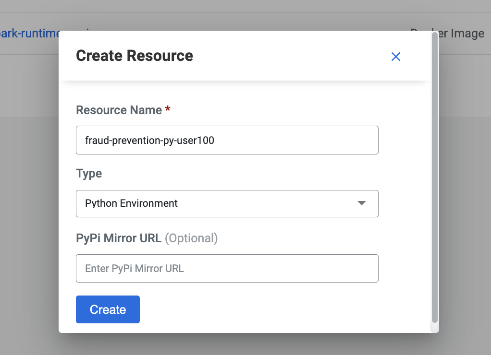

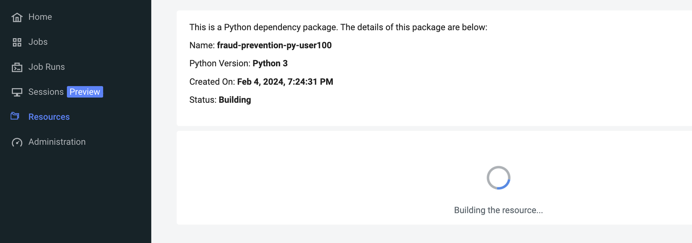


##### Creación de CDE Resource de tipo Files

Desde la página de Recursos, crea un Recurso de Archivos CDE. Sube todos los archivos contenidos en la carpeta "cde_spark_jobs". Nuevamente, asegúrate de que el Recurso tenga el nombre de usuario único del taller y que se cree en el Clúster Virtual asignado a ti.

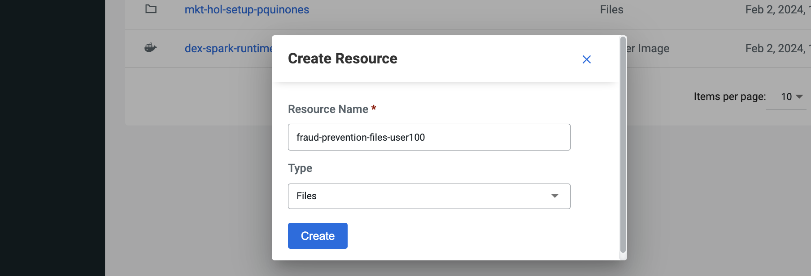

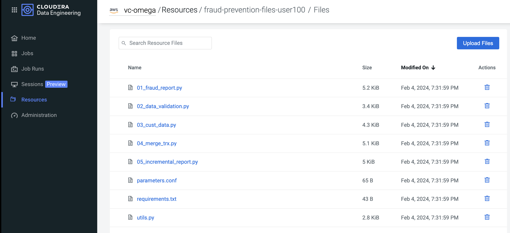

Antes de pasar al siguiente paso, familiarízate con el código en los archivos "01_fleet_report.py", "utils.py" y "parameters.conf".

Observa que "01_fleet_report.py" contiene el mismo código de aplicación PySpark que ejecutaste en la Sesión CDE, con la excepción de que los pasos de conversión de columnas y renombrado se han refactorizado en funciones de Python en el script "utils.py".

Finalmente, observa el contenido de "parameters.conf". Almacenar variables en un archivo en un Recurso de Archivos es un método utilizado por los Ingenieros de Datos de CDE para parametrizar dinámicamente scripts con valores externos.


##### Creación de CDE Spark Job

Ahora que los Recursos de CDE han sido creados, estás listo para crear tu primer CDE Spark Job.

Dirígete a la pestaña de Jobs CDE y haz clic en "Create Job". El formulario largo cargado en la página te permite construir un `spark-submit` como un CDE Spark Job, paso a paso.

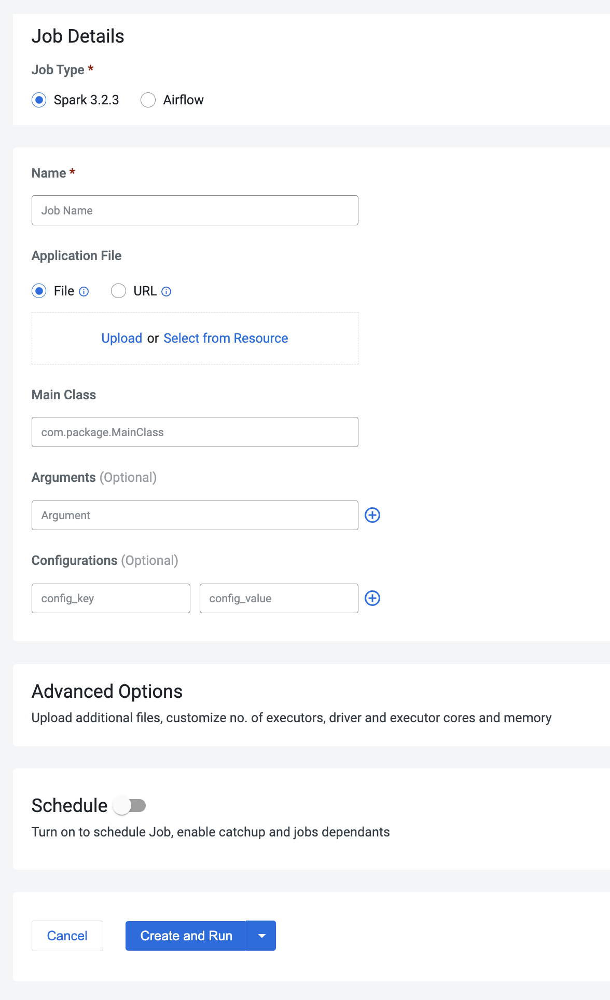

Ingresa los siguientes valores sin comillas en los campos correspondientes. Asegúrate de actualizar el nombre de usuario con tu usuario asignado donde sea necesario:

* Tipo de Job: Spark
* Nombre: 01_fleet_report_userxxx
* Archivo: Selecciona desde Recurso -> "01_fleet_report.py"
* Argumentos: userxxx
* Configuraciones:
  - clave: spark.sql.autoBroadcastJoinThreshold
  - valor: 11M

El formulario debería lucir similar a esto:

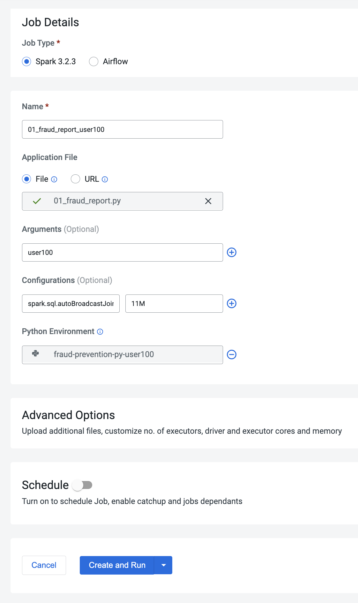

Finalmente, abre la sección de "Opciones Avanzadas".

Observa que tu Recurso de Archivos CDE ya ha sido mapeado al CDE Job para ti.

Luego, actualiza las Opciones de Cómputo aumentando "Núcleos del Executor" y "Memoria del Executor" de 1 a 2.

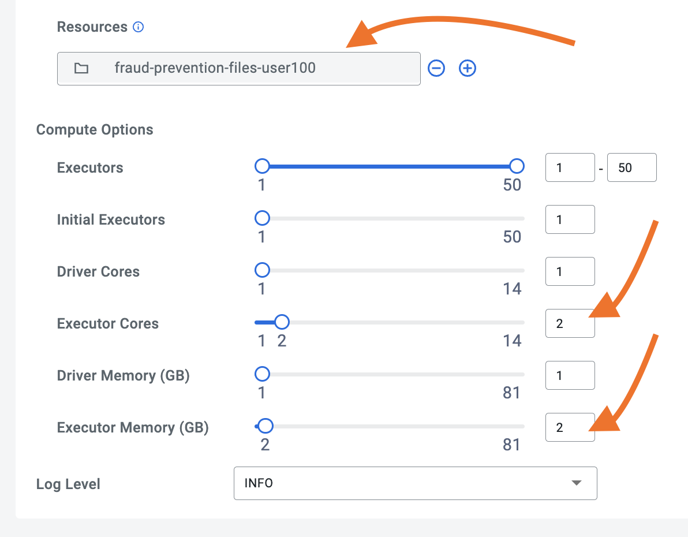

Finalmente, ejecuta el CDE Job haciendo clic en el ícono "Crear y Ejecutar".


##### CDE Job Run Observability

Dirígete a la página de Ejecuciones de Jobs (Job Runs) en tu Clúster Virtual y observa que automáticamente se está registrando una nueva Ejecución de Job para ti.

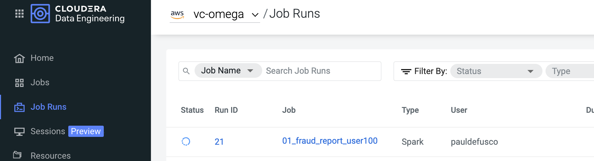

Una vez que la ejecución se complete, abre los detalles de la ejecución haciendo clic en el ID de ejecución (Run ID) en la página de Job Runs.

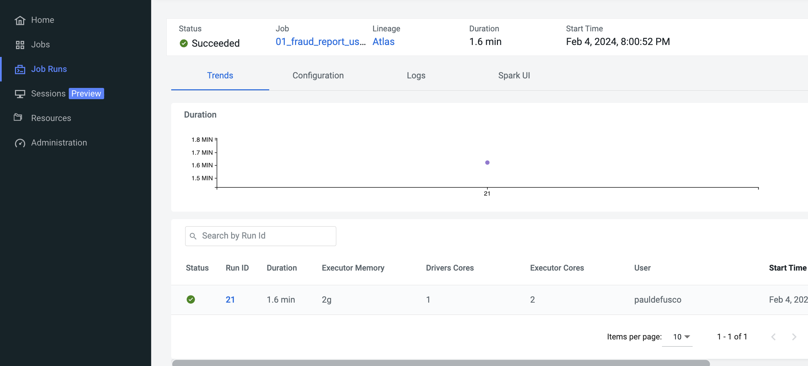

Abre la pestaña de registros (logs) y valida la salida de la Job Runs en la pestaña Driver -> Stdout.

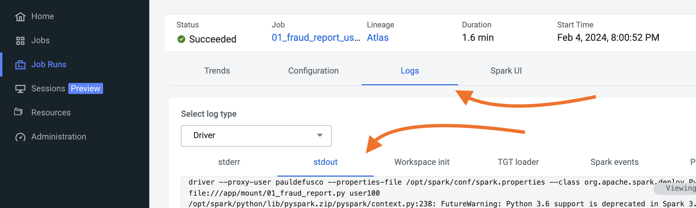

### Resumen

En esta sección, primero exploraste dos conjuntos de datos de forma interactiva con sesiones interactivas de CDE (CDE Interactive sessions). Esta función te permitió ejecutar consultas ad-hoc en datos grandes, estructurados y no estructurados, y prototipar código de aplicación Spark para ejecuciones por lotes.

Luego, creaste un Jobs por lotes (batch) de Spark para convertir tu prototipo de aplicación en una ejecución programada.

En el proceso, mejoraste tu código para reutilización al modularizar tu lógica en funciones y almacenar esas funciones como un script de utilidades (utils script) en un Files Resource CDE. También aprovechaste tu Files Resource al almacenar variables dinámicas en un archivo de configuración de parámetros (parameters configurations file) y aplicar una variable en tiempo de ejecución a través del campo de Argumentos (Arguments field). En el contexto de tuberías de CI/CD de Spark más avanzadas, tanto el archivo de parámetros como el campo de Argumentos pueden ser sobrescritos y anulados en tiempo de ejecución.

Para mejorar el rendimiento, tradujiste la UDF de PySpark a una UDF de Pandas. Creaste un Python CDE Resource y lo adjuntaste a la Definición del Job de CDE para usar Pandas y otras librerias de Python en tu PySpark Job.

Finalmente, ejecutaste el job y observaste las salidas en la página de Ejecuciones de Jobs (CDE Job Runs page). CDE almacenó las Ejecuciones, los registros y los Recursos de CDE asociados para cada ejecución. Esto te proporcionó capacidades de monitoreo y solución de problemas en tiempo real, junto con el almacenamiento posterior a la ejecución de registros, dependencias de ejecución e información del clúster.

### Enlaces y Recursos Útiles

Si tienes curiosidad por aprender más sobre las características mencionadas anteriormente en el contexto de casos de uso más avanzados, visita los siguientes recursos:

1. **Cloudera Data Engineering (CDE) Documentation**:
   - Explore la documentación oficial de Cloudera Data Engineering (CDE) para obtener detalles completos sobre características, tutoriales y guías de uso: [Cloudera Data Engineering Documentation](https://docs.cloudera.com/data-engineering/cloud/index.html)

2. **Apache Spark Documentation**:
   - Sumérgete en la documentación oficial de Apache Spark para profundizar en el uso de Spark para análisis de datos y procesamiento distribuido: [Apache Spark Documentation](https://spark.apache.org/docs/latest/)

3. **Cloudera Blogs and Articles**:
   - Encuentra artículos interesantes y blogs sobre Cloudera Data Engineering y tecnologías relacionadas en el sitio web de Cloudera: [Cloudera Blogs](https://blog.cloudera.com/)

4. **GitHub Repositories**:
   - Explora repositorios en GitHub relacionados con Cloudera Data Engineering y Apache Spark para obtener ejemplos de código y proyectos prácticos: [GitHub](https://github.com/)

5. **Cloudera Community Forums**:
   - Únete a la comunidad de Cloudera para hacer preguntas, compartir conocimientos y aprender de otros profesionales en el campo de la ingeniería de datos: [Cloudera Community](https://community.cloudera.com/)

Estos recursos te ayudarán a profundizar en el uso de Cloudera Data Engineering (CDE) y Apache Spark, así como a explorar casos de uso avanzados y mejores prácticas en el campo de la ingeniería de datos y el procesamiento distribuido.
